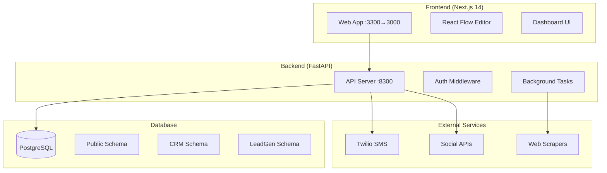

# War Room Architecture Context

## Overview
War Room is a Next.js + FastAPI monorepo for CRM, lead generation, and social media management.



## Service Ports
- Frontend: `3300:3000` (Docker mapped)
- Backend: `8300` (internal)
- Database: `10.0.0.11:5433` (Brain 2)

## Container Architecture
- `warroom-frontend-1`: Next.js app with standalone output
- `warroom-backend-1`: FastAPI with uvicorn
- Database: External PostgreSQL on Brain 2

## Authentication Flow
```yaml
type: JWT
claim: user_id
middleware: AuthGuardMiddleware (global)
multi_user: true # Eddy + wife
storage: httpOnly cookies + localStorage tokens
```

## Database Schemas
```yaml
public:
  - settings
  - facts  
  - kanban
  - agent_events

crm:
  - contacts
  - deals
  - pipelines
  - social_accounts

leadgen:
  - search_jobs
  - leads
```

## Key Technologies
- **Frontend**: Next.js 14, Tailwind CSS, React Flow (@xyflow/react)
- **Backend**: FastAPI, SQLAlchemy, asyncpg
- **Database**: PostgreSQL with multi-schema design
- **Communication**: Twilio (primary), Telnyx (backup)
- **Workflow**: React Flow templates (20 seeded)
- **Deployment**: Docker Compose