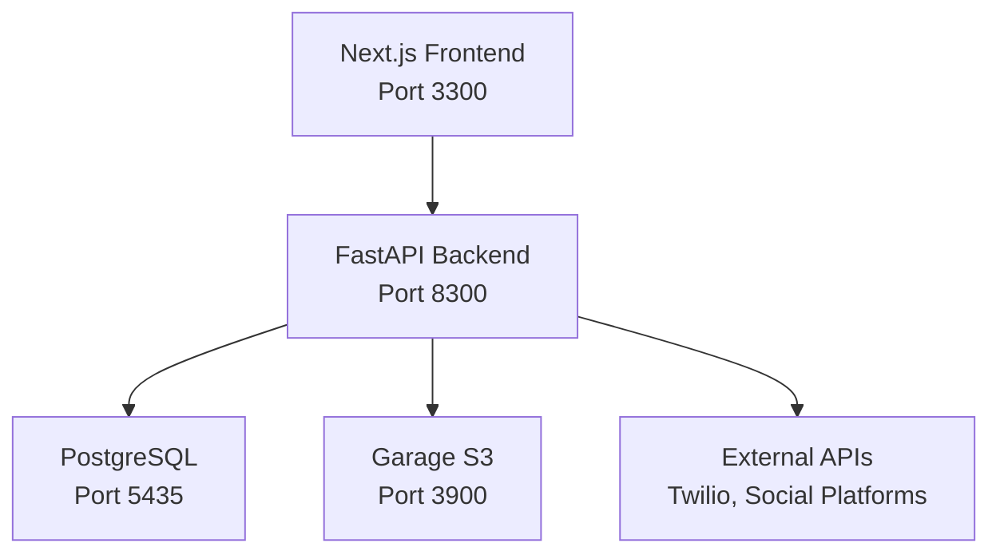

# War Room - Social Media Management Platform

War Room is a full-stack social media management platform built with FastAPI backend and Next.js frontend. It provides multi-tenant CRM capabilities, social media account management, content scheduling, and workflow automation.

## Quick Start

```bash
# Start all services
docker compose up -d --build --remove-orphans

# Backend API: http://localhost:8300
# Frontend: http://localhost:3300  
# Database: localhost:5435
```

## Architecture Overview



## Key Features

- **Multi-Tenant CRM**: Complete customer relationship management with user isolation
- **Social Media Integration**: Instagram, Facebook, LinkedIn, Twitter automation
- **Content Engine**: AI-powered content generation and scheduling  
- **Workflow Automation**: Custom workflows with React Flow visual editor
- **JWT Authentication**: Secure token-based auth with middleware validation
- **CSRF Protection**: Origin header validation for state-changing requests

## Current Focus Areas

- Content engine optimization and AI integration
- Social media platform API stability
- Performance optimization for large datasets
- Multi-tenant security hardening

## Development Notes

- Always use Docker rebuild commands with `--remove-orphans`
- JWT tokens contain `user_id` claim for multi-tenant data access
- CSRF middleware requires valid Origin header on POST/PUT/DELETE
- Database schemas: `crm` (main), `social` (social media data)