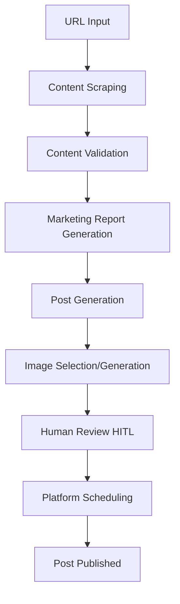

# Integration Research: agent-media-skill + social-media-agent

**Research Date:** March 18, 2026  
**Repositories Analyzed:**
- [yuvalsuede/agent-media-skill](https://github.com/yuvalsuede/agent-media-skill)
- [langchain-ai/social-media-agent](https://github.com/langchain-ai/social-media-agent)

---

## Executive Summary

This research analyzes two production-ready systems to extract patterns and integration opportunities for War Room:

1. **agent-media-skill** - A CLI-based UGC video production pipeline with AI actors, B-roll integration, and automated subtitles
2. **social-media-agent** - A LangGraph-powered social media automation system with human-in-the-loop workflows and multi-platform scheduling

Both systems offer complementary capabilities that align with War Room's vision: automated video content creation + intelligent social media distribution.

---

## 1. agent-media Pipeline Architecture

### Core Video Production Flow

```
Script Input → Scene Splitting → TTS Generation → AI Actor Rendering → 
B-roll Integration → Assembly → Subtitle Generation → Music → Output
```

### Key Components

#### 1.1 Scene Manifest Format
- **Script Splitting**: Natural language scripts are automatically segmented into scenes (~2.5 words per second timing)
- **Scene Structure**: Each scene contains dialogue, visual context, and timing metadata
- **Actor Mapping**: Scenes are tagged with specific actor performances and lip-sync requirements

#### 1.2 Actor/Persona System
- **Library Actors**: Pre-trained personas (sofia, naomi, marcus, adaeze) with consistent voice+face
- **Custom Personas**: User-uploaded voice samples + face photos for brand consistency
- **Implementation**: Voice cloning (TTS) + face synthesis + lip-sync alignment

#### 1.3 B-roll Integration Patterns
Two distinct modes:
- **Cutaway Mode** (`--broll`): Alternating between talking head and product screenshots
- **PIP Mode** (`--pip`): Picture-in-picture with full-frame talking head + rotating overlays

**Critical Insight**: B-roll images are **semantically matched** to script content based on filename descriptiveness.

#### 1.4 Subtitle Styles & Rendering
Available styles: `hormozi` (yellow karaoke), `minimal`, `bold` (neon cyan), `karaoke` (green), `clean`, `tiktok`, `neon`
- Animated word-by-word highlighting synchronized to speech
- Platform-optimized positioning (9:16 vs 16:9 vs 1:1)

#### 1.5 Async Operations & CLI Design
- **Sync Flag**: `--sync` waits for completion, returns final URL
- **Job Management**: Status tracking, download, cancel, retry operations
- **Credit System**: Pay-per-use model with balance checking

### What We Can Learn
1. **Scene Timing Algorithm**: 2.5 words/second provides natural pacing (our scripts often run too fast)
2. **Semantic B-roll Matching**: Filename-based scene assignment is simpler than complex NLP
3. **Credit Gates**: Approval workflows prevent accidental spending on large operations
4. **Word Count Enforcement**: Hard limits prevent unusable output (5s=12 words, 10s=25 words, 15s=37 words)

---

## 2. What We Can Adopt

### 2.1 Scene Splitting Algorithm
```typescript
// agent-media pattern - word-count-based scene timing
function validateScriptLength(script: string, durationSeconds: number): boolean {
  const words = script.split(/\s+/).length;
  const maxWords = durationSeconds * 2.5;
  return words <= maxWords;
}
```

**Integration Point**: Add to our `video_pipeline.py` script validation.

### 2.2 Semantic B-roll Matching
```bash
# agent-media pattern - descriptive filenames
--broll-images ./dashboard.png,./calendar-view.png,./pricing-page.png
```

**Integration Point**: Update our Nano Banana image generation to create descriptively-named assets that can be auto-matched to script segments.

### 2.3 PIP Mode Architecture
Full-frame talking head + rotating lower-third overlays:
- Actor speaks to camera (primary layer)
- Product shots/diagrams rotate in lower portion (secondary layer)
- Subtitles positioned above overlay area

**Integration Point**: New composition mode for our Remotion-based video_composer.py.

### 2.4 Approval Gates (Lobster Workflows)
Pre-execution validation:
```json
{
  "approvalRequired": true,
  "estimatedCredits": 800,
  "previewData": {
    "script": "...",
    "actor": "sofia", 
    "duration": 10
  }
}
```

**Integration Point**: Add approval steps before expensive Veo 3.1 operations.

---

## 3. What We Already Have

### 3.1 Video Generation Pipeline Mapping

| agent-media Component | War Room Equivalent | Status |
|----------------------|-------------------|--------|
| CLI Interface | REST API endpoints | ✅ Complete |
| Script Validation | video_pipeline.py validation | ✅ Basic validation |
| Scene Splitting | Manual storyboard creation | ⚠️ Manual process |
| TTS Generation | Not implemented | ❌ Missing |
| AI Actor Rendering | Veo 3.1 image-to-video | ✅ Different approach |
| B-roll Integration | Nano Banana image generation | ✅ Different workflow |
| Video Assembly | Remotion video_composer.py | ✅ Complete |
| Subtitle Generation | Not implemented | ❌ Missing |
| Credit/Usage Tracking | Basic usage logs | ⚠️ No approval gates |

### 3.2 Digital Copy System
Our "Digital Copy" personas are conceptually similar to agent-media's custom personas:
- We have character consistency via Nano Banana subject_consistency
- We generate reference sheets for visual consistency
- Missing: voice cloning and audio-visual synchronization

### 3.3 Asset Generation
Our Nano Banana service provides:
- Character reference sheets
- Scene-specific backgrounds  
- Product shots with brand consistency
- Infographic generation

**Gap**: No automated semantic matching between script content and generated assets.

---

## 4. Gaps to Fill

### 4.1 Critical Missing Components

#### Audio Pipeline
- **TTS Voice Synthesis**: No voice generation capability
- **Voice Cloning**: Cannot create custom brand voices
- **Audio-Visual Sync**: No lip-sync or speech timing alignment

#### Script Processing
- **Automatic Scene Splitting**: Manual storyboard creation vs automated segmentation
- **Word Count Validation**: No timing-based script validation
- **Scene-Asset Mapping**: No semantic matching between script and generated visuals

#### Subtitle Generation
- **Speech-to-Text**: No transcription capability
- **Animated Subtitles**: No word-by-word highlighting
- **Style Templates**: No subtitle style system

#### Approval Workflows
- **Cost Estimation**: No credit/cost preview before execution
- **Human Gates**: No approval checkpoints for expensive operations
- **Batch Operations**: No multi-video job management

### 4.2 Technical Debt
- **Async Job Management**: Basic status tracking vs comprehensive job lifecycle
- **Error Recovery**: Limited retry/recovery mechanisms
- **Resource Management**: No usage quotas or billing integration

---

## 5. social-media-agent Flow

### Core Architecture: LangGraph State Machine



### 5.1 URL → Content Pipeline

```typescript
// Content extraction flow
verifyLinksSubGraph → generateContentReport → generatePost
```

**Supported Sources:**
- General URLs (FireCrawl scraping)
- GitHub repos (PR analysis, release notes)
- YouTube videos (transcript + summary)
- Twitter threads (conversation context)

**Content Validation:**
- Business context matching (AI relevance filter)
- URL deduplication (prevents re-posting same content)
- Quality scoring (engagement prediction)

### 5.2 Human-in-the-Loop (HITL) Pattern

```typescript
// Agent Inbox integration
humanNode → userResponse → router
// Routes: rewritePost | schedulePost | updateScheduleDate | END
```

**Key Features:**
- **Interrupt-driven**: Graph pauses at human decision points
- **Multi-action support**: Approve, edit, reschedule, reject
- **Context preservation**: Full conversation history maintained
- **UI Integration**: Agent Inbox provides web interface

### 5.3 Platform Authentication & Scheduling

**Arcade Integration** (OAuth abstraction):
```typescript
// Unified auth for Twitter + LinkedIn
arcadeAuth.authenticate(platform: 'twitter' | 'linkedin')
arcadeScheduler.schedule(post, date, platform)
```

**Direct Integration** (fallback):
- Twitter API v2 (media upload + posting)
- LinkedIn API (personal + organization posting)

### 5.4 Image Selection & Upload

```typescript
// Image processing pipeline
findImagesInContent → validateImageRelevance → uploadToSupabase → attachToPost
```

**Image Sources:**
- Content-embedded images
- AI-generated images (Anthropic Claude)
- Stock photo integration
- User-uploaded assets

### 5.5 Prompt Engineering Patterns

**Business Context Injection:**
```typescript
const BUSINESS_CONTEXT = `
AI applications, UI/UX for AI, New AI/LLM research, Agents, 
Multi-modal AI, Generative UI, Open source AI tools...
`;
```

**Post Structure Template:**
```typescript
const POST_STRUCTURE = `
Section 1: Hook (≤5 words, optional emoji)
Section 2: Main content (3 sentences max, problem/solution focus)  
Section 3: Call to action (3-6 words, include link)
`;
```

**Few-shot Examples:**
Curated high-performing posts used as style templates.

---

## 6. Social Media Integration Plan

### 6.1 Phase 1: Basic Post Generation (Week 1-2)

**Objective**: URL → Post generation with human approval

**Components to Build:**
```python
# New service: social_media_service.py
class SocialMediaService:
    async def scrape_content(url: str) -> ContentSummary
    async def validate_relevance(content: str) -> bool  
    async def generate_marketing_report(content: str) -> Report
    async def generate_post(report: Report) -> SocialPost
    async def create_approval_request(post: SocialPost) -> ApprovalID
```

**Integration Points:**
- Extend existing `competitor_intel` scraping
- Add new approval workflow system
- Create post template engine

**Database Schema:**
```sql
CREATE TABLE social_media_posts (
    id SERIAL PRIMARY KEY,
    org_id INTEGER,
    source_url TEXT,
    content_summary JSONB,
    generated_post JSONB,
    approval_status TEXT, -- pending/approved/rejected
    scheduled_date TIMESTAMPTZ,
    platforms TEXT[], -- ['twitter', 'linkedin', 'tiktok']
    status TEXT -- draft/scheduled/published/failed
);
```

### 6.2 Phase 2: Platform Integration (Week 3-4)

**OAuth Setup:**
```python
# New service: platform_auth.py
class PlatformAuthService:
    async def authenticate_twitter(user_id: int) -> OAuthToken
    async def authenticate_linkedin(user_id: int) -> OAuthToken  
    async def authenticate_tiktok(user_id: int) -> OAuthToken
```

**Scheduling Service:**
```python
# New service: post_scheduler.py
class PostScheduler:
    async def schedule_post(post: SocialPost, platforms: List[str], date: datetime)
    async def publish_immediate(post: SocialPost, platforms: List[str])
    async def get_scheduled_posts(org_id: int) -> List[ScheduledPost]
```

### 6.3 Phase 3: Video Integration (Week 5-6)

**Video-Post Pairing:**
```python
class VideoSocialIntegration:
    async def generate_video_and_posts(competitor_url: str):
        # 1. Scrape competitor content
        content = await scrape_competitor_content(competitor_url)
        
        # 2. Generate video script + storyboard  
        video_script = await generate_video_script(content)
        
        # 3. Generate social media posts
        social_posts = await generate_social_posts(content)
        
        # 4. Start video production pipeline
        video_job = await start_video_pipeline(video_script)
        
        # 5. Return combined job
        return VideoSocialJob(video_job, social_posts)
```

**Cross-Platform Optimization:**
```python
# Platform-specific formatting
PLATFORM_CONFIGS = {
    'twitter': {'max_chars': 280, 'video_format': '16:9'},
    'linkedin': {'max_chars': 3000, 'video_format': '16:9'},
    'tiktok': {'max_chars': 2200, 'video_format': '9:16'},
}
```

### 6.4 Phase 4: Advanced Features (Week 7-8)

**Content Calendar Integration:**
- Editorial calendar view
- Content gap analysis
- Performance tracking
- A/B testing for post variations

**AI Optimization:**
- Engagement prediction
- Optimal posting time analysis
- Hashtag recommendations
- Platform-specific tone adjustment

---

## 7. Implementation Priority

### Immediate (This Sprint)
1. **Content Scraping Service** - Extend competitor intel for general URL scraping
2. **Post Template Engine** - Create structured post generation with business context
3. **Basic Approval Workflow** - Human-in-the-loop for generated posts
4. **Database Schema** - Social media posts and scheduling tables

### Sprint 2
5. **Platform OAuth Integration** - Twitter/LinkedIn authentication 
6. **Post Scheduling Service** - Date-based post publishing
7. **Image Processing Pipeline** - Auto-select images for social posts

### Sprint 3  
8. **Video-Social Pairing** - Generate video + matching social posts from single input
9. **TTS Integration** - Add voice generation to video pipeline
10. **Subtitle Generation** - Automated subtitles for video content

### Sprint 4
11. **Agent Inbox UI** - Human approval interface for post review
12. **Content Calendar** - Editorial planning and scheduling dashboard
13. **Performance Analytics** - Track engagement and optimize content

### Future Enhancements
14. **Voice Cloning** - Custom brand voices for Digital Copies
15. **Advanced B-roll Matching** - Semantic asset-to-script alignment
16. **Multi-platform Optimization** - Platform-specific content variations
17. **Automated A/B Testing** - Post variation testing and optimization

---

## Technical Implementation Notes

### Code Reference Mapping

| Feature | agent-media Reference | social-media-agent Reference | War Room Integration |
|---------|---------------------|----------------------------|-------------------|
| Scene Splitting | SKILL.md rules (2.5 words/sec) | N/A | `video_pipeline.py` validation |
| Post Generation | N/A | `generate-post-graph.ts` | New `social_media_service.py` |
| Human Approval | Lobster workflows | `humanNode` interrupts | New approval workflow |
| Platform Auth | N/A | `auth-socials.js` | New `platform_auth.py` |
| Content Scraping | N/A | `verify-links-graph.ts` | Extend `competitor_intel` |
| Job Management | CLI status commands | LangGraph state tracking | Enhance `video_pipeline.py` |

### Architecture Decisions

1. **State Management**: Adopt social-media-agent's LangGraph pattern for complex workflows
2. **Approval Gates**: Implement agent-media's Lobster-style approval before expensive operations  
3. **Platform Abstraction**: Use social-media-agent's unified posting interface pattern
4. **Asset Pipeline**: Enhance existing Nano Banana with agent-media's semantic matching
5. **Human Interface**: Build Agent Inbox-style UI for post approval and scheduling

This integration plan provides a clear roadmap for adding social media automation to War Room while leveraging proven patterns from both production systems.